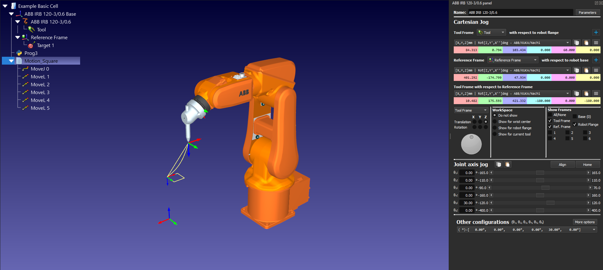
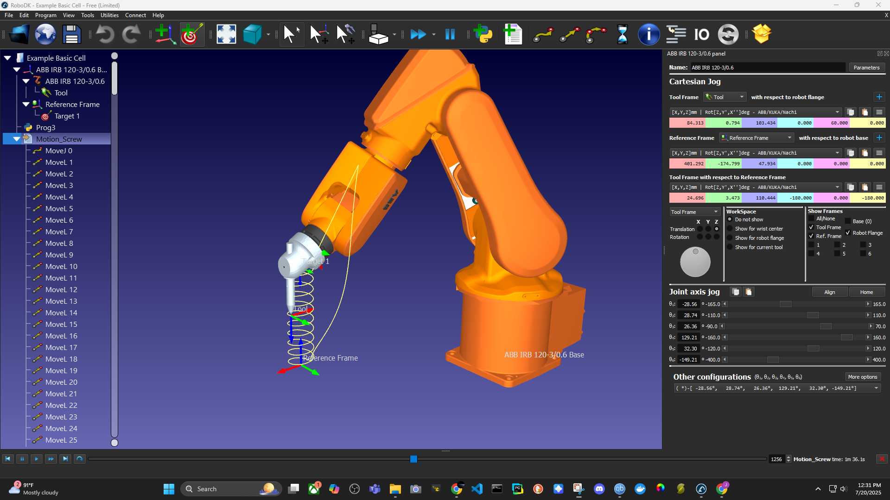
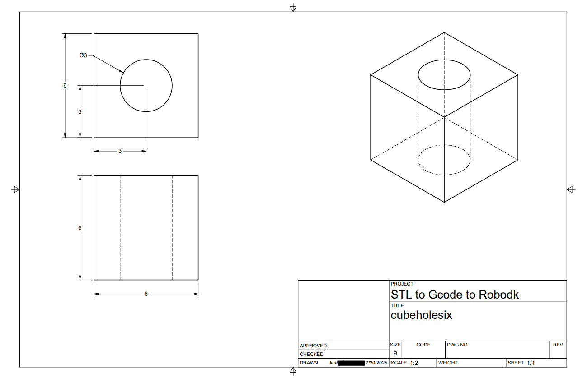

# Python_robodk_demo

## Project Overview

This project demonstrates how to use Python scripting with the RoboDK API to simulate robot toolpath programming for a 6-axis industrial robot. Specifically, it shows how to move the **ABB IRB 120-3/0.6** robot through various motion types using Python.

The **first exercise** focuses on foundational motion generation a square path in 3D space.

The **second exercise** demonstrates a more advanced motion — a screw (helical) path showcasing a continuous spiral with 10 rotations using linear TCP control. This highlights concepts such as orientation preservation and math-based trajectory generation.

The **final exercise** loads a real G-code file and animates the robot executing the toolpath. The G-code is parsed with Python and used to drive the ABB robot in RoboDK, simulating a CAM-to-robot workflow.

<table>
  <tr>
    <td></td>
    <td></td>
  </tr>
  <tr>
    <td align="center"><b>RoboDK Simulation (G-code)</b></td>
    <td align="center"><b>Physical Print Output</b></td>
  </tr>
</table>

---

## Objectives

* Connect to RoboDK using Python
* Set up robot tool and reference frames
* Use a pre-defined target as the pose anchor
* Dynamically generate custom toolpaths (square, spiral)
* Load and follow G-code toolpaths from file
* Visualize and simulate everything inside RoboDK

---

## What It Does

1. **Grabs the robot model** and assigns the active tool and reference frame.
2. **Retrieves a pose** from `Target 1` to use as a base pose.
3. **Generates or loads poses** depending on the task:
   - Square corners
   - Spiral screw path
   - G-code (e.g., from slicer output)
4. Uses `MoveL()` to execute smooth linear motion between points.
5. Optionally visualizes the full toolpath using `AddTarget()` or animated printhead simulations.

---

## Tools Used

* **Python** + `robodk` module
* **RoboDK** simulation environment
* **ABB IRB 120-3/0.6** robot model
* Custom RoboDK Targets & Frames
* G-code generated from Slic3r

---

## Results

* Square and spiral toolpaths executed without collisions
* Orientation maintained correctly using base pose from `Target 1`
* G-code simulation successfully executed using real print data
* RoboDK visually confirmed full path execution and printhead animation
* Real-world print matched simulation results

---

## 🔗 Resources

* [RoboDK Python API Docs](https://robodk.com/doc/en/PythonAPI/index.html)

---

> *This project shows how simple it is to bridge real-world CAM data and industrial robots using Python — perfect for learning offline programming, prototyping, and automation testing.*
